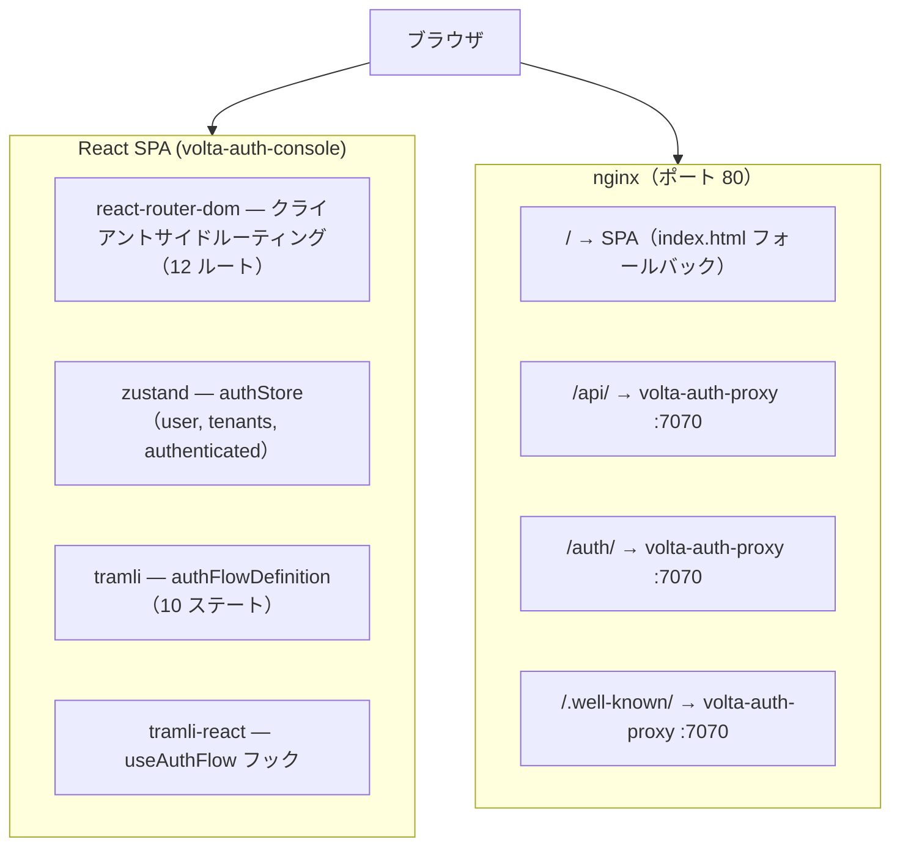
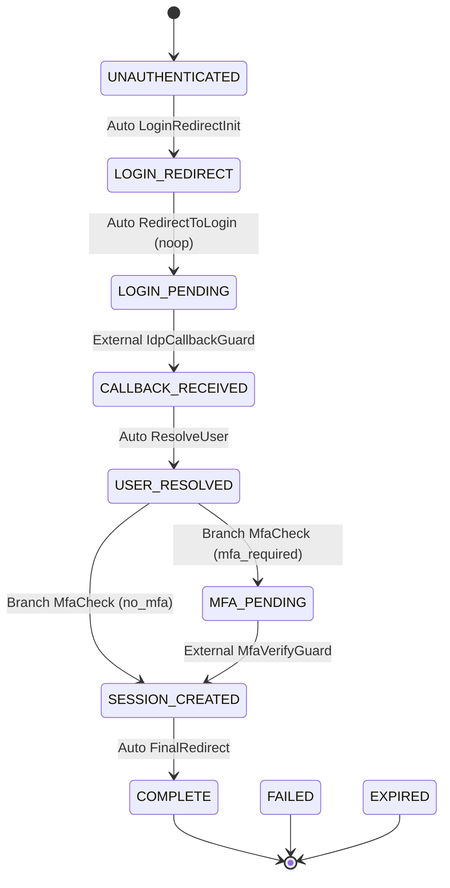
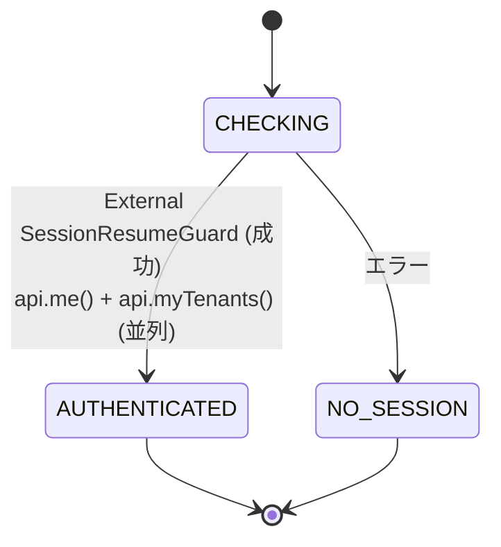
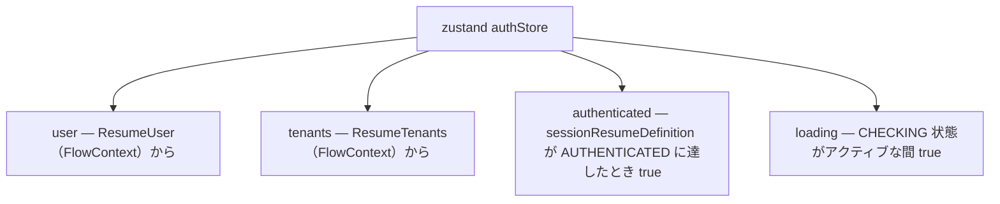
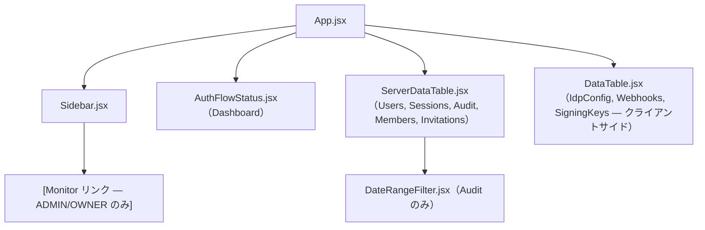

[English version](architecture.md)

# アーキテクチャ — volta-auth-console

## 目次

- [システム概要](#システム概要)
- [12 画面](#12-画面)
- [認証フロー (tramli)](#認証フロー-tramli)
- [状態管理](#状態管理)
- [API レイヤー](#api-レイヤー)
- [API 境界の非統一](#api-境界の非統一)
- [nginx.conf](#nginxconf)
- [コンポーネントマップ](#コンポーネントマップ)

---

## システム概要



SPA にサーバーサイドレンダリングはない。すべてのナビゲーションはクライアントサイド。マウント時の認証チェックは tramli `sessionResumeDefinition` フローで行い、`/api/v1/users/me` を呼び出す。Cookie セッションが有効であれば即座に認証済みとなり、無効なら `/login` にリダイレクトされる。

---

## 12 画面

| ルート | コンポーネント | アクセス権 |
|--------|--------------|----------|
| `/` | `Dashboard` | 認証済みユーザー |
| `/users` | `Users` | ADMIN / OWNER |
| `/tenants` | `Tenants` | ADMIN / OWNER |
| `/members` | `Members` | 認証済みユーザー |
| `/invitations` | `Invitations` | 認証済みユーザー |
| `/sessions` | `Sessions` | ADMIN / OWNER |
| `/audit` | `Audit` | ADMIN / OWNER |
| `/idp` | `IdpConfig` | OWNER |
| `/webhooks` | `Webhooks` | OWNER |
| `/keys` | `SigningKeys` | ADMIN |
| `/settings` | `Settings` | OWNER |
| `/monitor` | `Monitor` | ADMIN / OWNER |

---

## 認証フロー (tramli)

### authFlowDefinition — 10 ステート OIDC フロー

`src/store/authFlowDefinition.js` に定義。volta-auth-proxy Java 側の `AuthState` 列挙型と対称的な構造。



FlowContext キー（Java 側 `AuthData` と対称）:

| キー | 型 | セット者 |
|-----|------|--------|
| `RequestOrigin` | `{ returnTo }` | 初期コンテキスト |
| `AuthConfig` | オブジェクト | 初期コンテキスト |
| `LoginRedirect` | `{ url }` | LoginRedirectInit |
| `IdpCallback` | `{ code, state }` | IdpCallbackGuard |
| `ResolvedUser` | ユーザーオブジェクト | ResolveUser |
| `MfaResult` | `{ verified }` | MfaVerifyGuard |
| `SessionCookie` | `{ active }` | SessionCreator |
| `FinalRedirect` | `{ url }` | SessionCreator |
| `UserTenants` | Tenant[] | SessionCreator |

### sessionResumeDefinition — 2 ステート再開確認フロー



すべてのアプリマウント時に `useAuthFlow()` で呼び出される。`AUTHENTICATED` になると `ResumeUser` と `ResumeTenants` が zustand `authStore` に書き込まれる。

TTL: 30 秒（再開確認専用の短いフロー）。

---

## 状態管理



ストアは `useAuthFlow`（tramli の結果）のみで更新される。v0.2.0 で `authStore.init()` から直接 `api.me()` を呼ぶコードは削除済み。

---

## API レイヤー

`src/lib/api.js` — Cookie 付き fetch ラッパー。

ベース定数: `const BASE = '/api/v1'`

### ページネーションヘルパー

```js
function paginated(path, params = {}) {
  // null/undefined/空文字列の値はフィルタリング
  return request(`${path}${buildQuery(params)}`);
}
```

ページネーション対応メソッドは `{ page, size, sort, q, from, to, event, status, user_id }` を受け取る。

ページネーションレスポンス形式（volta-auth-proxy v0.x）:

```json
{
  "items": [...],
  "total": 1234,
  "page": 1,
  "size": 50,
  "pages": 25
}
```

---

## API 境界の非統一

現在 3 つのパスプレフィックスが混在している — 既知の技術的負債:

| プレフィックス | エンドポイント | 問題 |
|--------------|-------------|------|
| `/api/v1/` | すべての管理・テナント API | 正規 — 唯一のプレフィックスにすべき |
| `/api/me/` | `mySessions` のみ | 非統一 — `/api/v1/users/me/sessions` に変更すべき |
| `/auth/` | `revokeSession`（DELETE）のみ | 非統一 — `/api/v1/sessions/:id` に変更すべき |

**根本原因**: `mySessions` と `revokeSession` が API バージョニングポリシー確立前に別々のタイミングで追加された。

**修正計画**: volta-auth-proxy のルーティングが安定したタイミングで `/api/v1/` に統一する。`api.js` 内に `// TODO: unify prefix` コメントを残して追跡。

---

## nginx.conf

```nginx
server {
    listen 80;
    root /usr/share/nginx/html;
    index index.html;

    # SPA フォールバック — マッチしないパスはすべて index.html を返す
    location / {
        try_files $uri $uri/ /index.html;
    }

    # volta-auth-proxy へのプロキシ
    location /api/ {
        proxy_pass http://192.168.1.13:7070;     # ← ハードコード — デプロイ前に変更
        proxy_set_header Host $host;
        proxy_set_header X-Forwarded-For $proxy_add_x_forwarded_for;
        proxy_set_header X-Forwarded-Proto $scheme;
    }

    location /auth/ {
        proxy_pass http://192.168.1.13:7070;     # ← ハードコード
        proxy_set_header Host $host;
        proxy_set_header X-Forwarded-For $proxy_add_x_forwarded_for;
    }

    location /.well-known/ {
        proxy_pass http://192.168.1.13:7070;     # ← ハードコード
        proxy_set_header Host $host;
    }
}
```

**問題**: バックエンド IP `192.168.1.13:7070` がハードコードされている。これは例の値。

**本番環境での推奨修正**:

```nginx
upstream volta_auth_proxy {
    server ${VOLTA_PROXY_HOST}:${VOLTA_PROXY_PORT};
}
# その後: proxy_pass http://volta_auth_proxy;
```

またはコンテナ起動時に `envsubst` で nginx.conf をテンプレート展開する。

---

## コンポーネントマップ



`DataTable`（クライアントサイド）と `ServerDataTable`（サーバーサイド）は意図的に共存する。データセットが小さく上限がある画面（IdP 設定・Webhook・署名鍵）は `DataTable` を、上限のないデータセットの画面は `ServerDataTable` を使用する。
