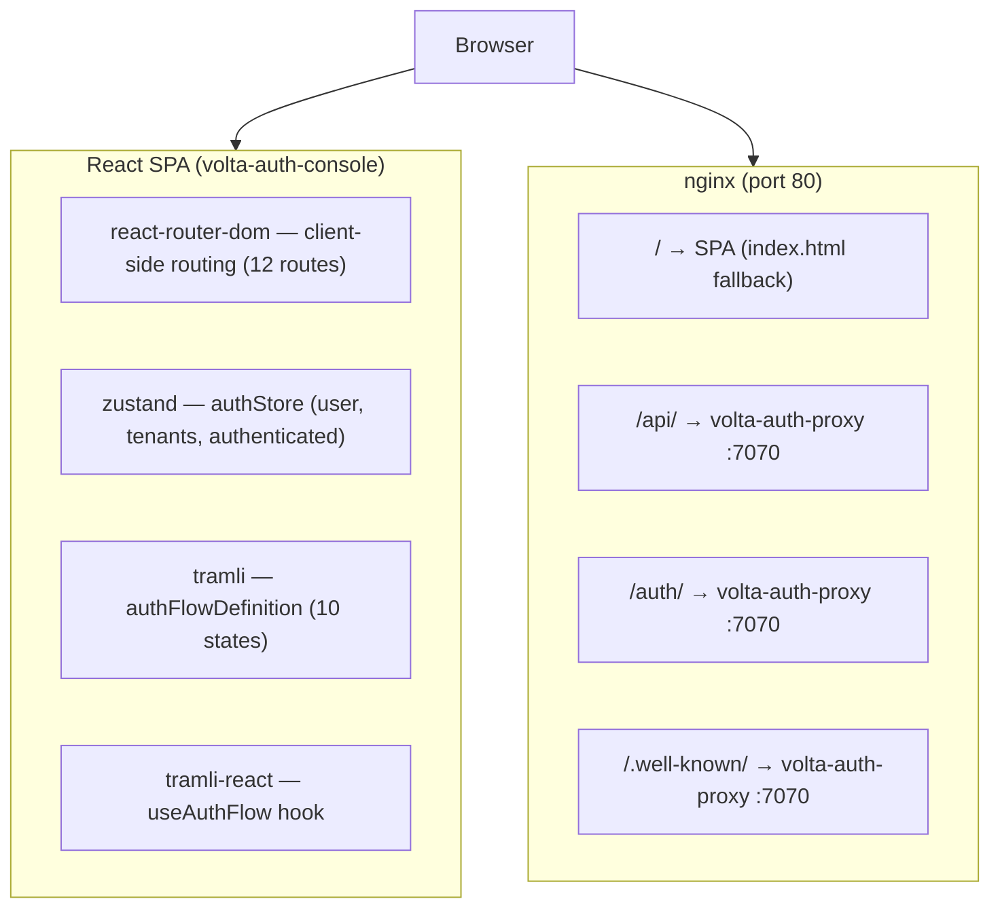
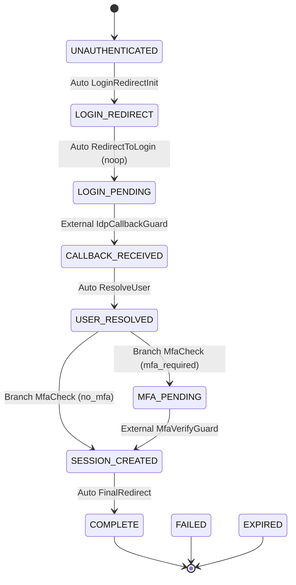
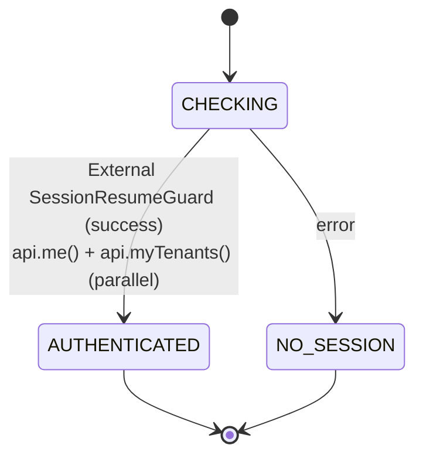
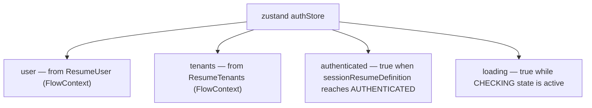
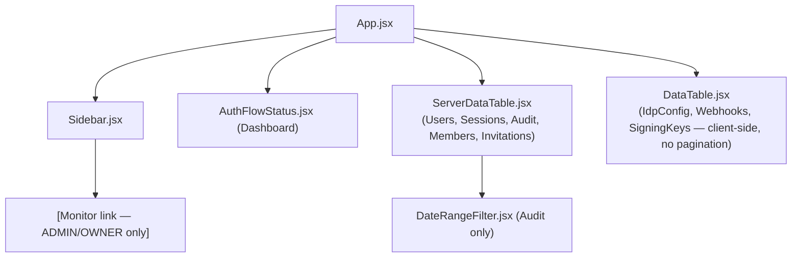

[日本語版](architecture-ja.md)

# Architecture — volta-auth-console

## Table of Contents

- [System Overview](#system-overview)
- [12 Pages](#12-pages)
- [Auth Flow (tramli)](#auth-flow-tramli)
- [State Management](#state-management)
- [API Layer](#api-layer)
- [API Boundary Inconsistency](#api-boundary-inconsistency)
- [nginx.conf](#nginxconf)
- [Component Map](#component-map)

---

## System Overview



The SPA has no server-side rendering. All navigation is client-side. The auth check on mount uses the tramli `sessionResumeDefinition` flow, which calls `/api/v1/users/me` — if the cookie session is valid the user is authenticated immediately; otherwise they are redirected to `/login`.

---

## 12 Pages

| Route | Component | Access |
|-------|-----------|--------|
| `/` | `Dashboard` | Authenticated |
| `/users` | `Users` | ADMIN / OWNER |
| `/tenants` | `Tenants` | ADMIN / OWNER |
| `/members` | `Members` | Authenticated |
| `/invitations` | `Invitations` | Authenticated |
| `/sessions` | `Sessions` | ADMIN / OWNER |
| `/audit` | `Audit` | ADMIN / OWNER |
| `/idp` | `IdpConfig` | OWNER |
| `/webhooks` | `Webhooks` | OWNER |
| `/keys` | `SigningKeys` | ADMIN |
| `/settings` | `Settings` | OWNER |
| `/monitor` | `Monitor` | ADMIN / OWNER |

---

## Auth Flow (tramli)

### authFlowDefinition — 10-state OIDC flow

Defined in `src/store/authFlowDefinition.js`. Mirrors the Java-side `AuthState` enum in volta-auth-proxy.



FlowContext keys (mirroring Java `AuthData`):

| Key | Type | Set by |
|-----|------|--------|
| `RequestOrigin` | `{ returnTo }` | Initial context |
| `AuthConfig` | object | Initial context |
| `LoginRedirect` | `{ url }` | LoginRedirectInit |
| `IdpCallback` | `{ code, state }` | IdpCallbackGuard |
| `ResolvedUser` | User object | ResolveUser |
| `MfaResult` | `{ verified }` | MfaVerifyGuard |
| `SessionCookie` | `{ active }` | SessionCreator |
| `FinalRedirect` | `{ url }` | SessionCreator |
| `UserTenants` | Tenant[] | SessionCreator |

### sessionResumeDefinition — 2-state resume



Called on every app mount via `useAuthFlow()`. If `AUTHENTICATED`, `ResumeUser` and `ResumeTenants` are written into zustand `authStore`.

TTL: 30 seconds (short — resume check only).

---

## State Management



The store is populated exclusively by `useAuthFlow` (tramli result). Direct `api.me()` calls are removed from `authStore.init()` in v0.2.0.

---

## API Layer

`src/lib/api.js` — credential-bearing fetch wrapper.

Base constant: `const BASE = '/api/v1'`

### Pagination helper

```js
function paginated(path, params = {}) {
  // null/undefined/empty-string values are filtered out
  return request(`${path}${buildQuery(params)}`);
}
```

Paginated methods accept `{ page, size, sort, q, from, to, event, status, user_id }`.

Paginated response shape (from volta-auth-proxy v0.x):

```json
{
  "items": [...],
  "total": 1234,
  "page": 1,
  "size": 50,
  "pages": 25
}
```

---

## API Boundary Inconsistency

Three path prefixes are in use — this is a known tech debt:

| Prefix | Endpoints | Issue |
|--------|-----------|-------|
| `/api/v1/` | All admin + tenant endpoints | Canonical — should be the only prefix |
| `/api/me/` | `mySessions` only | Inconsistent — should be `/api/v1/users/me/sessions` |
| `/auth/` | `revokeSession` (DELETE) only | Inconsistent — should be `/api/v1/sessions/:id` |

Root cause: `mySessions` and `revokeSession` were added at different times before an API versioning policy was established.

**Remediation plan**: Align under `/api/v1/` when volta-auth-proxy stabilises its routing. Track in `api.js` with `// TODO: unify prefix` comments.

---

## nginx.conf

```nginx
server {
    listen 80;
    root /usr/share/nginx/html;
    index index.html;

    # SPA fallback — all unmatched paths serve index.html
    location / {
        try_files $uri $uri/ /index.html;
    }

    # Proxy to volta-auth-proxy
    location /api/ {
        proxy_pass http://192.168.1.13:7070;     # ← HARDCODED — change before deploy
        proxy_set_header Host $host;
        proxy_set_header X-Forwarded-For $proxy_add_x_forwarded_for;
        proxy_set_header X-Forwarded-Proto $scheme;
    }

    location /auth/ {
        proxy_pass http://192.168.1.13:7070;     # ← HARDCODED
        proxy_set_header Host $host;
        proxy_set_header X-Forwarded-For $proxy_add_x_forwarded_for;
    }

    location /.well-known/ {
        proxy_pass http://192.168.1.13:7070;     # ← HARDCODED
        proxy_set_header Host $host;
    }
}
```

**Problem**: The backend IP `192.168.1.13:7070` is hardcoded. This is an example value.

**Recommended fix for production**:

```nginx
upstream volta_auth_proxy {
    server ${VOLTA_PROXY_HOST}:${VOLTA_PROXY_PORT};
}
# then: proxy_pass http://volta_auth_proxy;
```

Or use `envsubst` to template the nginx.conf at container startup.

---

## Component Map



`DataTable` (client-side) and `ServerDataTable` (server-side) coexist intentionally. Pages with small, bounded datasets (IdP configs, webhooks, signing keys) use `DataTable`; pages with unbounded datasets use `ServerDataTable`.
