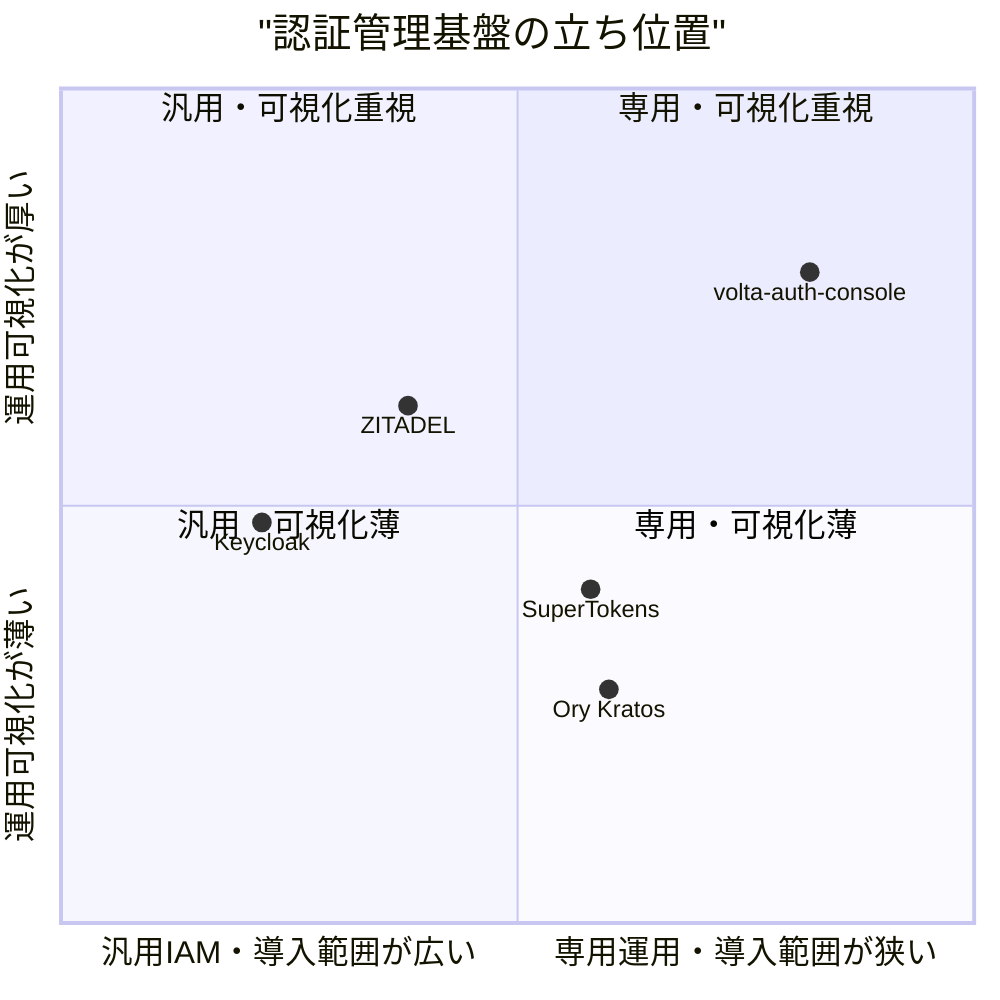
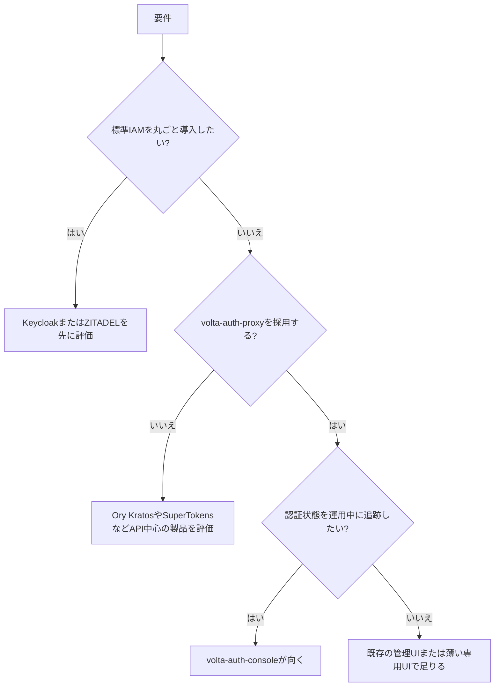

# 0. 要約

立ち位置: volta-auth-proxy 専用の管理UIとして、認証状態を tramli で追跡し、12画面とリアルタイム認証イベント監視を一体化している。

最大の弱点: Keycloak や ZITADEL のような汎用IAM製品と比べ、エンドユーザー向けの設定・プロトコル・運用機能の幅、導入実績、テストの厚みがまだ公開数字で証明できない。

次の一手: 既存の認証フロー可視化を中核に、監査ログの検索・保存・権限境界を運用機能として固め、標準的なIAM全体を追わない。

# 1. このrepoは何か

## 一言

`volta-auth-proxy` の管理者向けReact SPAである。ブラウザ側の認証状態を `@unlaxer/tramli` の状態機械で管理し、バックエンドの `/api/v1/` と `/auth/` を呼び出す。

## 提供価値

ADMIN / OWNER が、ユーザー、テナント、メンバー、招待、セッション、監査イベント、IdP、Webhook、署名鍵、設定を一つの画面から操作できる。さらに `/monitor` では、SSEの認証イベントフィードと `/viz/ws` のtramliフロー可視化を同じ管理面に置く。これは単独のUIライブラリではなく、`volta-auth-proxy` と一緒に使って初めて認証基盤の運用価値になる。

したがって比較単位は「Reactの管理画面」ではなく、「認証サーバー＋管理コンソールで、組織・ユーザー・認証運用を管理する仕組み」とした。

## 想定利用者

自前の認証基盤を運用するプロダクトチーム、複数テナントを管理する管理者、認証障害を状態遷移で追いたい運用担当者。公開された利用者数や本番稼働状況は確認できない。

## 到達点の客観指標（2026-07-31）

| 指標 | 確認値 | 出典・確認方法 |
|---|---:|---|
| ルート | 12 | `src/App.jsx` とREADME |
| APIメソッド | 20 | `src/lib/api.js` の `api` export を確認 |
| ソース行数 | 2,220行 | `find src -type f ... | xargs wc -l` |
| テスト | 12 pass / 1 file | `npm test -- --run` 実行結果 |
| 本番ビルド | 成功、gzip 64.90KB + 95.29KBのJS | `npm run build` 実行結果 |
| Lint | 20 errorsで失敗 | `npm run lint` 実行結果。既存のdge/bin、Tenant effect、未使用変数等 |
| 公開利用状況 | 分からない | リポジトリ内資料からは確認できない |

この数字から、画面の網羅性に対して自動テストは狭い。ビルドは通るが、品質ゲートとしてのLintは通っていない。市場で勝負する以前に、認証管理UIとして重要な権限境界・破壊的操作・ライブ監視の回帰テストが不足していると読むのが妥当である。

# 1.5 調査の型

`hybrid` と判定した。自repoはコードとして配布できるSPAだが、単体では認証基盤にならず、`volta-auth-proxy` というバックエンドと組み合わせて価値を出す。一方、比較対象は管理UI単体ではなく、認証サーバーと管理面を含むOSS製品である。

比較軸は、(1) ユーザー・テナント運用、(2) IdP / MFA / セッション、(3) 監査・Webhook・鍵運用、(4) 管理者が原因を追える可観測性、(5) 導入・拡張・ライセンスである。競合の巨大なモノレポ全体をローカル実行してAPI数やテスト数を同じ条件で測ることは今回できなかったため、4.5では公開ソースから読めた管理UIの構造と、自repoで実測した数字を分けて記載し、confidenceは「中」に留める。

# 2. 比較対象と選定理由

| 製品 | 何ができるか | 採用状況（2026-07-31） | ライセンス | うちとの決定的な違い | なぜ比較対象に選んだか |
|---|---|---|---|---|---|
| Keycloak | Realm、ユーザー、クライアント、IdP、認可、管理APIを備えた汎用IAM。管理UIも同一製品に含む | ★34.9k / 最新リリース 26.6.3（2026-06-04） | Apache-2.0 | 汎用プロトコル・拡張・エコシステムが広い一方、volta固有のtramli監視はない | OSS IAMの事実上の大規模基準で、管理UIの代替候補になるため |
| ZITADEL | 組織、プロジェクト、ユーザー、OIDC/SAML、MFA、監査、Actions等を管理するIAM | ★13.9k / 最新リリース v4.15.0（2026-05-04） | AGPL-3.0（ディレクトリごとの例外あり） | 組織・プロジェクト中心のマルチテナント設計が強く、管理コンソールはAngularの専用アプリ | マルチテナント運用と監査を正面から比較できるため |
| SuperTokens | セッション、パスワードレス、ソーシャルログイン、MFA等を組み込める認証基盤。管理用ダッシュボードも提供 | ★15.0k / 最終更新 2026-05-29 | Apache-2.0系のCommunity License。機能ごとの商用条件は要確認 | アプリ組込みの開発者体験と認証レシピが主で、voltaのような管理対象の広いB2B運用面とは異なる | 同じく「Auth0代替」を掲げ、導入の軽さという反対側の基準になるため |
| Ory Kratos | API-firstのヘッドレス認証・アイデンティティ管理。Passkey、ソーシャルログイン、MFA、Webhook等 | ★13,671 / 最新リリース v26.2.0（2026-03-20） | Apache-2.0 | UIは薄く、API・セルフサービスフロー中心。管理コンソールを含む完成品ではない | 「管理UIを自作する」選択肢の代替であり、責務分割の比較対象になるため |

この地図は、汎用IAMの大規模製品（Keycloak、ZITADEL）と、組込みやヘッドレスを重視する製品（SuperTokens、Ory）の間にある。標準認証機能そのものは既製品が強く、voltaの勝ち筋は機能数ではなく、独自の認証状態機械と運用イベントを同じ画面で理解できることにある。星数は採用の証明ではないが、公開コミュニティの規模差は無視できない。

# 3. ポジショニング

横軸は公開機能の汎用性と導入範囲、縦軸は管理者が認証の状態・履歴・原因を追える深さを表す。voltaの位置は、tramli-vizとSSEの実装を根拠にした相対評価であり、競合の可視化機能を同一環境で実測したものではない。

# 4. 機能比較

| 機能 | 重み | volta-auth-console | Keycloak | ZITADEL | SuperTokens | Ory Kratos |
|---|---|---|---|---|---|---|
| ユーザー管理・検索 | ◎必須 | ○ | ○ | ○ | ○ | ○（API中心） |
| マルチテナント／組織 | ◎必須 | ○ | ○（Realm） | ○ | △ | △（構成・製品範囲による） |
| メンバー・招待・ロール | ◎必須 | ○ | ○ | ○ | △ | △ |
| OIDC / SAML IdP設定 | ◎必須 | ○ | ○ | ○ | ○（構成依存） | ○（構成依存） |
| MFA / Passkey運用 | ◎必須 | △（バックエンド状態を表示・操作） | ○ | ○ | ○ | ○ |
| セッション一覧・失効 | ◎必須 | ○ | ○ | ○ | ○ | ○（API中心） |
| 監査ログ検索 | ◎必須 | ○（時刻・イベント・ページング） | ○ | ○ | △ | ○（イベント/API） |
| Webhookと配信履歴 | ○効く | ○ | △（拡張・イベント中心） | ○ | ○ | ○ |
| 署名鍵ローテーション | ○効く | ○ | ○ | ○ | △ | △ |
| リアルタイム認証イベント | ◎必須（差別化） | ○（SSE） | △ | △ | △ | △ |
| 認証フロー状態の可視化・再生 | ◎必須（差別化） | ○（tramli-viz / replay） | × | × | × | × |
| 標準API・SDK・エコシステム | ◎必須 | △（volta-auth-proxy依存） | ○ | ○ | ○ | ○ |
| 自前バックエンドへの組込み容易性 | ○効く | ○（専用） | △ | △ | ○ | ○ |

凡例: ○=ある / △=部分的・要設定 / ×=確認できない・無い。競合の「○」は公式機能説明またはリポジトリ資料で確認した範囲であり、同じ操作をこの調査環境で実行した結果ではない。

痛い×は標準API・SDK・エコシステムの弱さである。管理者UIを採用しても、アプリ側・IdP側・運用ツール側の接続で毎回volta固有の説明が必要になる。反対に、標準的なユーザー一覧、セッション失効、監査ログは競合にもあるため、実装できているだけでは差別化にならない。最重要の○は、認証イベントを実時間で受け、状態機械として追跡する点である。

# 4.5 コード・実装の比較

| 観点 | volta-auth-console | Keycloak Admin UI | ZITADEL Management Console | 出典・注記 |
|---|---:|---|---|---|
| UI技術 | React 19 + Vite 8 | React + PatternFly + Vite | Angular + Nx | 各リポジトリのREADME、package.json |
| UIソース規模 | 2,220行（src） | 今回は未集計 | 今回は未集計 | 競合は製品全体のモノレポで、同条件の集計をしていない |
| テスト実測 | 12 pass / 1 file | 実行していない | 実行していない | 自repo `npm test -- --run`。競合のCI結果とは比較していない |
| 依存パッケージ数 | dependencies 8、devDependencies 12 | 公開package.jsonを確認、総数は未集計 | Nx/proto生成等の依存チェーンを確認、総数は未集計 | 数えなかった数字を推測しない |
| API境界 | `/api/v1/`中心の専用REST | Admin Client Provider + Admin REST | v1/v2 APIと生成protobuf | Keycloak Admin UI README、ZITADEL console README |
| 配布形態 | SPAをvolta-auth-proxyの前段に配置 | IAMサーバーに同梱 | IAMサーバーに同梱 | README / 各公式リポジトリ |
| ライセンス | リポジトリにLICENSEファイルなし（要確認） | Apache-2.0 | AGPL-3.0等 | GitHub repository表示 |

実装の前提が違う。Keycloakは再利用可能な管理UIコンポーネントとAdmin Client Providerを整備し、ZITADELはprotobuf生成とv1/v2 APIの移行をビルドチェーンに組み込んでいる。voltaは小さく、バックエンドのAPI契約を直接画面に写像できる反面、API契約の変更・認可・テストがそのままUIのリスクになる。なお競合コードの全量比較は実施していないため、ここから実装優劣は主張しない。

# 5.5 調査者の見立て

本当の勝負所は、12画面の数ではなく「いま認証のどの状態で、どのイベントが起き、誰に影響したか」を管理者が短時間で説明できることだと思う。標準IAMの機能競争に入れば、KeycloakやZITADELの蓄積に勝てない。

数字に出ていない懸念は、管理UIの操作が認証・鍵・セッションという高リスク領域に触れるのに、現在のテストがAPIエラーとURL生成を中心に12件しかないことだ。READMEとdocsでMonitorの状態記述が食い違っていた点も、運用機能の現状を文書化する仕組みが弱い兆候に見える。

私なら、まずtramliの状態遷移を監査イベントの共通モデルにし、Monitor・Audit・セッション操作を同じ相関IDで辿れるようにする。これなら「認証基盤全体」ではなく「認証運用の説明可能性」という狭い価値に投資できる。

この見立てが外れる条件は、利用者がリアルタイム可視化よりも標準SDK、SAML、SCIM、細粒度認可を選定理由にする場合である。その場合、専用可視化は付加機能に過ぎず、既製品を採用してvolta-auth-consoleを維持する理由が薄くなる。

# 6. 提案（優先順）

| 順 | 提案 | 分類 | 根拠 | 最小の一手 | 効きそうな指標 |
|---:|---|---|---|---|---|
| 1 | Monitor・Audit・セッション操作に相関ID、actor、tenant、結果、時刻を共通付与する | 伸ばす | 認証フロー可視化が競合との差別化。現状はSSEイベントとAuditが別の画面モデル | `AuthEvent`の最小スキーマを決め、SSEと監査APIの表示を同じ型にする | 1操作から原因イベントまでのクリック数、未相関イベント率 |
| 2 | 破壊的操作と権限境界のUIテストを増やし、LintをCIの合格条件にする | 埋める | 12テスト、Lint 20 errors。対象はMFAリセット、鍵ローテーション、テナント停止、セッション失効 | 各操作の成功・403・再送・確認ダイアログを最低1ケースずつ追加 | 重要操作の回帰テスト数、Lint error 0、誤操作率 |
| 3 | `volta-auth-proxy`のAPI契約から管理画面の型・権限表・画面を生成または検証する | 埋める | 専用RESTの軽さが利点だが、専用バックエンドへの結合が弱点 | OpenAPIまたは契約テストを一つのAPI領域で導入 | API不整合による画面障害数、契約カバレッジ |
| 4 | 公開デモと導入手順を用意し、12画面とMonitorの価値を外部から再現可能にする | 埋める | stars・利用状況・公開稼働状況は分からず、採用判断の証拠がない | seeded demo tenantとスクリーンショット、最小composeを公開 | 初回起動時間、デモ完了率、外部issue数 |
| 5 | 標準IAM製品の全機能（SCIM、細粒度認可、全SDK、管理UIの汎用化）を追わない | やらない | Keycloak/ZITADELとの機能数競争は差別化を薄める。Ory等を置き換える仕事でもない | 対象外リストをREADMEに明記し、要望を「可視化」「運用説明」に分類する | 対象外機能への工数、差別化機能の利用率 |

# 7. 選択の分岐

# 8. 出典

| URL | 参照日 | 何の根拠に使ったか |
|---|---|---|
| https://github.com/opaopa6969/volta-auth-console | 2026-07-31 | 自repoの公開リポジトリ、README、commit、ライセンス表示、現行コード |
| https://github.com/keycloak/keycloak | 2026-07-31 | star数、Apache-2.0、最新リリース、Keycloakの製品範囲 |
| https://github.com/keycloak/keycloak/tree/main/js/apps/admin-ui | 2026-07-31 | 管理UIのReact/Vite/PatternFly、再利用可能コンポーネント、Admin Client Providerの実装説明 |
| https://www.keycloak.org/docs/latest/server_admin/ | 2026-07-31 | Realm、ユーザー、クライアント、IdP等の管理機能 |
| https://github.com/zitadel/zitadel | 2026-07-31 | star数、AGPL-3.0、最新リリース、組織・OIDC・SAML・MFA等の範囲 |
| https://github.com/zitadel/zitadel/tree/main/console | 2026-07-31 | Management ConsoleのAngular構成、v1/v2 API、protobuf生成とNxビルドチェーン |
| https://zitadel.com/docs/guides/manage/ | 2026-07-31 | 組織、プロジェクト、ユーザー、監査等の管理機能 |
| https://github.com/supertokens/supertokens-core | 2026-07-31 | star数、最終更新、OSS認証基盤としての範囲 |
| https://supertokens.com/docs | 2026-07-31 | セッション、MFA、パスワードレス、管理機能の公式説明 |
| https://supertokens.com/legal/community-license | 2026-07-31 | Community LicenseとApache 2.0系のライセンス条件 |
| https://github.com/ory/kratos | 2026-07-31 | star数、Apache-2.0、最新リリース、ヘッドレス認証の範囲 |
| https://www.ory.com/kratos | 2026-07-31 | API-firstのアイデンティティ管理、Passkey、MFA、ソーシャルログイン等 |
| https://github.com/ory/kratos/releases | 2026-07-31 | v26.2.0のリリース日と機能更新 |

競合のstar数・最終更新は参照日で変動する。競合の管理操作を実際にログインして実行したわけではなく、機能表の競合側は公式リポジトリと公式ドキュメントに基づく。自repoのテスト、ビルド、Lintはこの調査日にローカル実行した。
