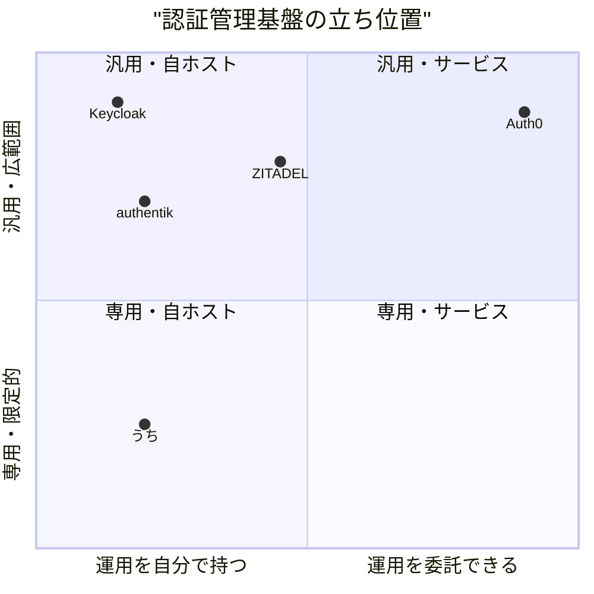
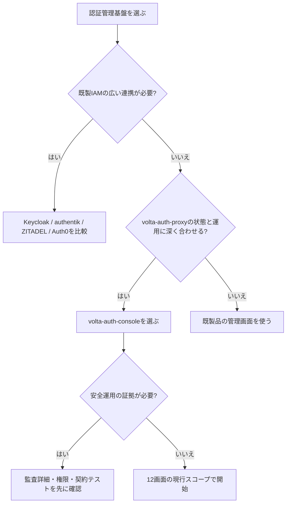

# 0. 要約

- 立ち位置: `volta-auth-proxy` 専用の認証管理SPAとして、12画面・OIDC状態可視化・テナント運用を一体化している。
- 最大の弱点: Keycloak/authentik/ZITADEL/Auth0 が持つアプリ・接続・権限・監査・運用エコシステムに対して、現状はプロキシ固有APIの管理面に留まる。
- 次の一手: まず「管理者が安全に運用できる証拠」を、監査詳細・権限境界・失敗時の復旧導線・デプロイ設定の4点で固める。

# 1. このrepoは何か

一言でいえば、`volta-auth-proxy` の管理者向けReact SPAである。README、`src/pages/`、`src/lib/api.js`、`src/store/authFlowDefinition.js`を確認した。

価値はこのrepo単体では閉じていない。ブラウザのSPAがnginx経由で `volta-auth-proxy` のAPIを呼び、バックエンドがOIDCのトークン交換とセッションを担当する。したがって比較単位は「Reactの管理画面」ではなく、認証プロキシとその管理コンソールを合わせた運用体験とした。

主な利用者は、認証基盤を運用するADMIN/OWNERである。実装済みの画面はDashboard、Users、Tenants、Members、Invitations、Sessions、Audit、IdP設定、Webhooks、Signing Keys、Settings、Monitorの12画面。OIDCフローは10状態、セッション再開フローは2状態である。Monitorは `@unlaxer/tramli-viz` の公開とバックエンドWebSocket実装待ちで、現状はComing Soonである。

調査時点の客観指標は、`src/` 26ファイル・2,220行、APIオブジェクトの公開メソッド26個、テスト14ケース、runtime dependencies 7個である。`npm test` はVitest起動時に `node_modules/vite/index.js` が見つからず失敗し、`npm run build` も `vite: not found` で実行できなかった。これは機能の欠陥と断定せず、調査環境で検証できなかった事実として扱う。

# 1.5 調査の型

`hybrid` と判定した。公開コードとして読めるSPA部分と、実行時に別repoの認証サービスを必要とするサービス結合部分があるためである。比較軸は、管理機能、マルチテナントと権限、認証方式・IdP連携、監査と運用、安全な配布・拡張性とした。Keycloak、authentik、ZITADELはOSS本体と管理UIを比較し、Auth0は公開ダッシュボード機能とサービスとして比較した。

# 2. 比較対象と選定理由

| 製品 | 何ができるか | 採用状況 | ライセンス | うちとの決定的な違い | なぜ比較対象に選んだか |
|---|---|---|---|---|---|
| Keycloak | ユーザー、ロール、クライアント、設定、IdP、User Federation、イベントをAdmin Consoleで管理 | ★34.9k / 26.6.3が2026-06-04時点で最新（参照日: 2026-07-31） | Apache-2.0 | 汎用IAMサーバーと管理UIが同一製品。拡張SPIと広いプロトコル対応がある | 自ホスト型IAMの最大級の基準。管理画面の網羅性と拡張点を比較するため |
| authentik | SAML、OAuth2/OIDC、LDAP、RADIUS等のIdP、アプリ・Provider・Flow・Policy・ユーザー管理、イベント監視 | ★22.6k（参照日: 2026-07-31）。最新リリースの正確な日付は今回の取得結果からは断定しない | リポジトリ概要だけではライセンス詳細を確定できない | Flow/Stage/Policyを管理画面から組み立てる。アプリ保護の運用面が厚い | 自ホスト型で、単なるユーザーCRUDを超えて認証フローを運用する近いOSS |
| ZITADEL | 組織、プロジェクト、アプリ、ロール、ユーザー、管理者、監査イベント、Webhookを管理 | ★14.4k / v4.15.0が2026-05-04時点で最新（参照日: 2026-07-31） | AGPL-3.0。ただしディレクトリごとの例外がある | Identity System→Organizations→Projectsという階層と、組織間の委譲管理が中核 | マルチテナントと委譲権限の設計を比較するため |
| Auth0 | Applications/APIs/SSO、Organizations、Users/Roles、Universal Login、MFA、ログ、Actions等をSaaSで提供 | GitHub starsは該当せず。サービス採用状況の公開定量値は今回確認できず | Proprietary | ホスティング、サポート、課金、連携エコシステムまで含めた完成品 | 自作管理画面を置き換える最も直接的なSaaS代替。機能ではなく運用責任も比較できる |

この地図は、単純な「管理UIの見た目」競争ではなく、認証基盤全体の責任範囲の競争である。Keycloakは拡張可能な汎用OSS、authentikはフローとアプリ保護、ZITADELは階層的なマルチテナント、Auth0は運用をサービス側に寄せる。自repoはこの4つと同じ広さを狙うより、`volta-auth-proxy` の状態モデルと運用要件に深く合わせることで比較可能な価値を作るべきだと読める。

# 3. ポジショニング

軸は、各製品の公開資料で確認できる提供形態と管理対象の広さを表す。座標は定量ランキングではなく、調査者による整理である（推測）。

# 4. 機能比較

| 機能 | 重み | うち | Keycloak | authentik | ZITADEL | Auth0 |
|---|---|---|---|---|---|---|
| ユーザー・メンバー管理 | ◎必須 | ○ | ○ | ○ | ○ | ○ |
| テナント/組織の分離 | ◎必須 | ○ | △ realm中心 | △ instance中心 | ○ | ○ |
| OIDC/SAML IdP設定 | ◎必須 | △ 画面/APIはあるが範囲不明 | ○ | ○ | ○ | ○ |
| MFA・認証フローの管理 | ◎必須 | △ proxy依存。画面はMFA分岐を表示 | ○ | ○ | ○ | ○ |
| アプリ/クライアント管理 | ◎必須 | × | ○ | ○ | ○ | ○ |
| ロール・細粒度権限 | ◎必須 | △ ADMIN/OWNER中心 | ○ | ○ | ○ | ○ |
| セッション一覧・失効 | ○効く | ○ | ○ | ○ | ○ | ○ |
| 招待・メンバーライフサイクル | ○効く | ○ | △ | △ | ○ | ○ |
| 監査ログ・検索・外部転送 | ◎必須 | △ 一覧と期間/イベント検索 | ○ | ○ | ○ | ○ |
| Webhook・配信履歴 | ○効く | ○ | △ 拡張/イベント連携 | △ | ○ | ○ |
| Signing keyのローテーション | ◎必須 | ○ | ○ | △ | ○ | ○ |
| 管理画面での認証フロー可視化 | ○効く | △ Monitorはブロック中 | × | ○ Flow UI | △ | × |
| セルフホスト | ○効く | ○ | ○ | ○ | ○ | × |
| ベンダーSLA/サポート | △あれば | × | △ 別契約 | △ 別契約 | △ 別契約 | ○ |

凡例: ○=ある / △=部分的・要設定・範囲不明 / ×=無い。重みはこのrepoの専用管理面としての重要度であり、一般的なIAM製品の総合点ではない。

この表で最も痛い×はアプリ/クライアント管理である。認証基盤を導入した利用者が最初に設定する対象を管理できないため、管理画面としての完結性を損なう。一方、セルフホストやSigning keyの操作は自repoの文脈では明確な価値があり、汎用製品との差別化候補になる。○の数を競うより、proxyの認証状態と管理操作が安全につながることを優先すべきである。

# 4.5 コード・実装の比較

| 観点 | うち | Keycloak Admin UI | ZITADEL Console | 出典 |
|---|---:|---|---|---|
| 管理UIの実装 | React 19 + Vite 8 | React + PatternFly + Vite | Angular。ZITADEL monorepo内のconsole | 自repo `package.json`、各公式README |
| 自repoの実装規模 | 26 src files / 2,220 lines | 管理UI package.jsonは130 LOC。UI本体の全LOCは今回数えられず | consoleディレクトリ配下のsrcと生成protoを使用。全LOCは今回数えられず | 自repoのfind/wc、GitHubファイル表示 |
| 公開API面 | `api`に26メソッド | `AdminClientProvider` と再利用可能なページ/コンポーネント | v1/v2 APIの生成クライアントを併用 | `src/lib/api.js`、Keycloak Admin UI README、ZITADEL Console README |
| テスト実行 | 14ケースを定義。実行はVite欠落で失敗 | package.jsonにunit/integration testとPlaywright設定 | Nxのbuild/lint/test構成を確認 | 各package.json/README、実行結果 |
| 依存の前提 | `volta-auth-proxy` とローカルfile依存のdxe-suiteが必要 | Keycloak provider/admin client/ui-sharedに依存 | proto生成、client build、Nxに依存 | 各README |
| ライセンス | リポジトリ内に明示的なLICENSEは今回確認できず | Keycloak本体 Apache-2.0 | AGPL-3.0。例外は個別確認が必要 | 各リポジトリのLicense表示 |

実装方針は大きく異なる。自repoはproxyのAPI境界を直接薄く包み、少ない部品で専用運用を作る。一方Keycloakは再利用可能なAdmin UIライブラリとクライアント層を分け、ZITADELはproto生成とNxでAPI契約をUIビルドへ組み込む。自repoの軽さは強みだが、API契約の変更検知と再利用性は先行例に及ばない。

# 5.5 調査者の見立て

本当の勝負所は、機能数ではなく「認証事故が起きたときに、管理者が状態を理解して安全に戻せるか」だと思う。10状態のtramliフローを持つ自repoは、汎用IAMよりproxy固有の失敗原因を表示できる余地がある。

数字に出ていない懸念は、APIの契約と画面の対応がまだ一つの専用repoに閉じていることだ。Monitorが上流issueとWebSocket実装に依存している事実からも、画面の完成度だけでは運用価値が成立しない。

私なら、アプリ管理を広く追加する前に、監査イベントの詳細表示、操作前後の権限確認、セッション/鍵操作の確認と復旧、proxyとのAPI契約テストを先に整える。そこで「この管理画面があるから安全に運用できる」と言える状態を作る。

この見立てが外れる条件は、利用者が実際には管理者ではなく、固定された少数の内部運用者だけであり、アプリ設定を別の運用手段で済ませている場合である。その場合、アプリ管理の欠落は痛手ではなく、Monitorやtramli可視化の方が最大の価値になる。

# 6. 提案（優先順）

| 順 | 提案 | 分類 | 根拠 | 最小の一手 | 効きそうな指標 |
|---:|---|---|---|---|---|
| 1 | 監査イベントを詳細化し、誰が・何を・対象・結果・相関IDを表示する | 埋める | 監査は◎必須だが現状は一覧/検索中心。ZITADELも履歴とAPI提供を中核にする | APIレスポンスとAudit画面に詳細/相関ID列を追加する設計をproxyと合意 | 事故調査に要する時間、監査イベントの欠落率 |
| 2 | ADMIN/OWNERを固定判定から権限セットへ拡張し、画面・APIの両方で拒否理由を出す | 伸ばす | 現状のrole境界は明確だが、Keycloak/ZITADELは細粒度の管理者スコープを持つ | permission matrixを文書化し、1画面だけ実装してAPI拒否をテストする | 権限境界テスト数、誤操作/403の解決時間 |
| 3 | OIDC/SAML接続とアプリ/クライアントの最小管理を追加する | 埋める | アプリ/クライアント管理が◎必須で現状×。Auth0/Keycloak/ZITADELはいずれも管理対象 | まず一覧・作成・無効化だけを1種類のclientで提供する | 初回接続の完了時間、proxy APIを直接触る運用の減少 |
| 4 | API契約テストと依存の再現可能なCIを整える | 埋める | `npm test`/`build`が依存欠落で起動できず、画面の安全性を継続検証できない | lockfileとfile依存を含むCIでinstall→test→buildを実行する | CI成功率、API変更での早期検知数 |
| 5 | tramli Monitorを、上流WebSocketが揃うまで「操作可能な模擬再生」ではなく診断画面として先に出す | 伸ばす | 専用repo固有の差別化だが、現状は2つの上流ブロッカーで未提供 | blockerの状態、必要なendpoint、最後の接続失敗時刻を表示する | 問い合わせから原因特定までの時間 |
| 6 | Keycloak級の全機能（LDAP/RADIUS/多数のprovider、汎用workflow）を追いかける | やらない | 差別化を薄め、proxyの責任範囲を越える。既製品への置換で満たせる | 対象外リストと、外部IAMを選ぶ条件をREADMEに明記する | 未実装機能を追加しない判断の記録 |

# 7. 選択の分岐

# 8. 出典

| URL | 参照日 | 何の根拠に使ったか |
|---|---|---|
| [自repo README](https://github.com/opaopa6969/volta-auth-console/blob/f026838ea98c2913ecc844b96b024bd5d5cdd200/README.md) | 2026-07-31 | 12画面、技術構成、API境界、Monitorのブロッカー |
| [自repo package.json](https://github.com/opaopa6969/volta-auth-console/blob/f026838ea98c2913ecc844b96b024bd5d5cdd200/package.json) | 2026-07-31 | React/Vite、依存、テスト・buildコマンド |
| 自repoの `src/`、`src/lib/api.js`、`src/store/authFlowDefinition.js` | 2026-07-31 | APIメソッド数、フロー状態、実装規模。ローカルで読んだ |
| [Keycloak repository](https://github.com/keycloak/keycloak) | 2026-07-31 | stars、Apache-2.0、最新リリース |
| [Keycloak Server Administration Guide](https://www.keycloak.org/docs/latest/server_admin/) | 2026-07-31 | Admin Consoleの管理対象、IdP federation、ユーザー/ロール/クライアント |
| [Keycloak Admin UI](https://github.com/keycloak/keycloak/tree/main/js/apps/admin-ui) | 2026-07-31 | React/PatternFly/Vite、再利用可能コンポーネント、AdminClientProvider、コード確認 |
| [Keycloak Admin UI package.json](https://github.com/keycloak/keycloak/blob/main/js/apps/admin-ui/package.json) | 2026-07-31 | 130 LOC、test/integration test、build依存のコード確認 |
| [authentik repository](https://github.com/goauthentik/authentik) | 2026-07-31 | stars、対応プロトコル、OSS/enterpriseの位置づけ、リポジトリ構成 |
| [authentik documentation](https://docs.goauthentik.io/) | 2026-07-31 | Flow、Provider、Policy、イベント監視、管理UI |
| [authentik user interface overview](https://docs.goauthentik.io/users-sources/user/user-interface/) | 2026-07-31 | Admin interfaceでユーザー、グループ、設定を管理する事実 |
| [ZITADEL repository](https://github.com/zitadel/zitadel) | 2026-07-31 | stars、AGPL-3.0、最新リリース、監査・Webhook・階層 |
| [ZITADEL Organizations](https://zitadel.com/docs/guides/manage/console/organizations) | 2026-07-31 | 組織階層、分離、委譲、プロジェクト |
| [ZITADEL audit trail](https://zitadel.com/docs/concepts/features/audit-trail) | 2026-07-31 | 監査履歴とAPI提供 |
| [ZITADEL Management Console](https://github.com/zitadel/zitadel/tree/main/console) | 2026-07-31 | Angular、proto生成、Nx、v1/v2 APIを併用する実装確認 |
| [Auth0 Dashboard](https://auth0.com/docs/get-started/auth0-overview/dashboard) | 2026-07-31 | Applications、Organizations、Users、Roles、Security、Logs等の公開機能 |
| [Auth0 pricing](https://auth0.com/pricing) | 2026-07-31 | SaaSの料金/機能制約、監査ログ連携、MFA等 |

