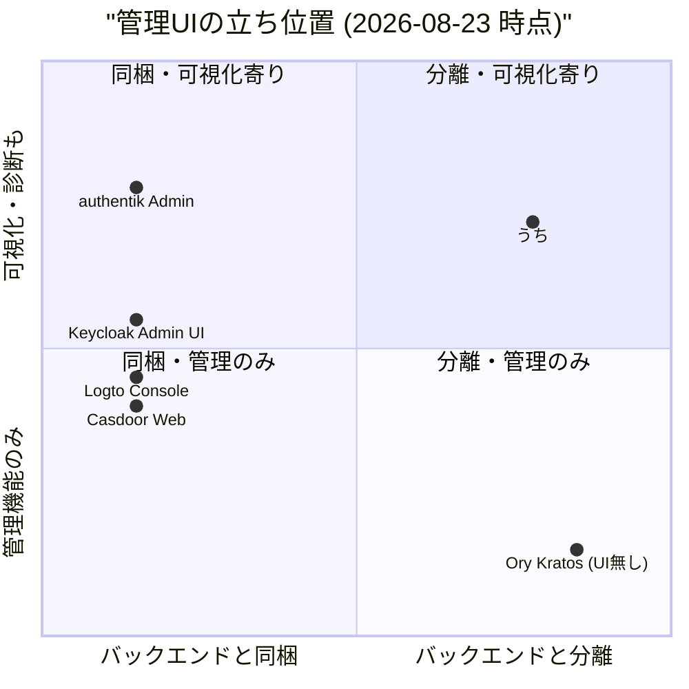
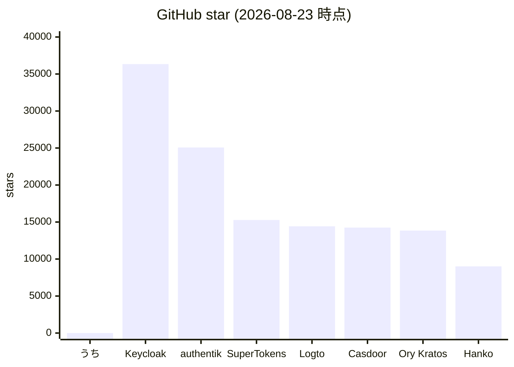
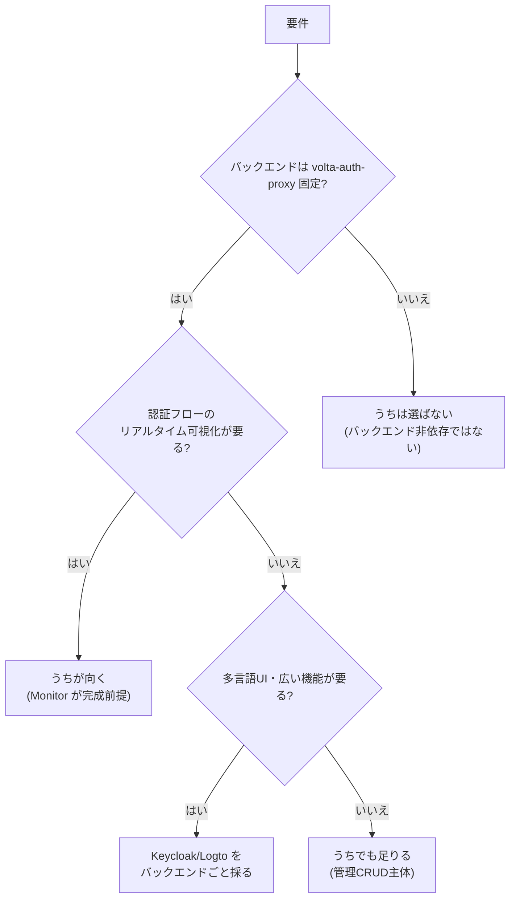

# 市場調査: volta-auth-console

## 0. 要約

立ち位置: `volta-auth-proxy` 専用の React 製管理 SPA。単体では価値を出さず、バックエンドIdPと組み合わせて初めて管理UIとして成立する。

最大の弱点: バックエンド依存で利用可能画面が決まり、API契約テスト・i18n・アプリ/クライアント管理が無い。比較対象はどれもバックエンド込みの統合製品で、UIだけ切り出して比べると見取り図がずれる。

次の一手: まず **API 契約テストと i18n** を整え、Monitor の可視化を完成させる。そのうえでバックエンドのアプリ管理APIが載れば最小限のクライアント管理画面を足す。**汎用IAMコンソールは作らない**。

## 1. このrepoは何か

- 一言: `volta-auth-proxy`（自己ホスト型マルチテナント認証ゲートウェイ）の **Admin SPA**。React 19 + Vite 8 + Tailwind CSS v4 製。
- 提供価値: 運用者がブラウザからユーザー・テナント・メンバー・招待・セッション・監査ログ・IdP 設定・Webhook・署名鍵を操作する手間を無くす。**認証・セッション検証・OIDC トークン交換はすべてバックエンドが担い、この SPA は状態表示とCRUD呼び出しのみを行う**。
- 想定利用者: `volta-auth-proxy` を運用する管理者（ADMIN / OWNER ロール）。一般ユーザー向け画面は無い。
- **比較の単位**: repo単体ではなく **「IdPバックエンド + 管理SPA」の組み合わせ**。代わりに何を使うかと聞かれたら、Keycloak / Logto / authentik / Casdoor のように **バックエンド込みで管理UIもセット** の統合IAMに丸ごと置き換わる。UIだけのライブラリと比べると土台が違う。
- 到達点の客観指標（実際に確認した数字）:
  - ソース `src/` 配下 **2,425 行**（`wc -l` 実測、`.js`+`.jsx` 合計）
  - ページ **12 画面**（`src/pages/` のファイル数で実測）
  - テスト **12 pass / 1 file**（`npm test` 実行、`src/lib/api.test.js` のみ）
  - 依存（runtime）**7 パッケージ**（`package.json` の `dependencies`、`@unlaxer/dxe-suite` は `file:../DxE-suite` のローカル参照）
  - 依存（dev）**16 パッケージ**。`react-router-dom` / `zustand` は `devDependencies` に誤分類（README 記載の既知の問題）
  - npm 公開: していない（`private: true`）
  - 公開URL: 無し（ローカル開発用、`nginx.conf` はバックエンドIP `192.168.1.13:7070` をハードコード）
  - 最終コミット: 2026-08-14（`bb711af`）
  - GitHub star: **0**（`gh api` 実測、2026-08-23。作成 2026-04-04、非公開運用）
  - i18n: **未実装**（`src/` に locales / i18n ファイル無し、`find` で実測）
  - ライセンス: リポジトリに `LICENSE` ファイル無し（`gh api` で `licenseInfo: null`）

## 1.5 調査の型

**`library`** とした。コードが読める React SPA であり、比較の主軸は **「何画面を持つか」「依存がどれだけ軽いか」「テストがどれだけあるか」「i18n/配布/拡張点」** などの実装面だからである。ただし単体では動かずバックエンドと組み合わせて初めて価値が出るため、純粋なUIライブラリではなく **「特定IdP専用の管理UI実装」** として比較する。

`service` にしなかった理由: 公開URLが無く、実際に触って確認できない。`internal` にしなかった理由: 自家用基盤ではなく、将来的には `volta-auth-proxy` の利用者全員に配るUIなので、自作vs既製品の判断ではなく「同じ層の管理UIと比べてどうか」が問いだから。

**`confidence: 中`** とした理由: 比較対象のstar・最終更新・ライセンス・ディレクトリ構成はGitHub APIとREADMEで確認したが、**比較対象のコードを深く読んでいない**（Keycloak / Logto / authentik / Casdoor は数十万行規模で、本次調査の範囲外とした）。自repoのコードは全て読んだ（`src/` 全ファイル + `docs/`）。比較対象のコードを今回読まなかったのは、このrepoの価値がUI単独ではなく「バックエンド依存の管理SPA」という形そのものにあり、比較対象のUI実装の巧拙より**画面構成・依存構成・配布形態**の事実関係を確かめる方が効くと判断したため。

## 2. 比較対象と選定理由

比較対象は **バックエンド込みで管理UIを提供するIAM** から選んだ。理由は、このrepoの価値が「IdP + 管理UI」の組み合わせで現れ、UIだけ切り出して比較すると土台がずれるから（書式1.5節の注記に従う）。管理UI部分に絞って情報を集めた。

| 製品 | 何ができるか | 採用状況 | ライセンス | うちとの決定的な違い | なぜ選んだか |
|---|---|---|---|---|---|
| Keycloak Admin UI | realm/ユーザー/クライアント/IdP/認証フロー/セッション/イベント/組織/ユーザーフェデレーション(LDAP/Kerberos) を管理。React + PatternFly。バックエンドはKeycloak本体 | ★36,339 / 最終更新 2026-08-22 | Apache-2.0 | 機能・規模・運用実績が圧倒的。管理UIはバックエンドと単一repoで配布 | 自己ホストIAMの事実上の標準。管理UIの「どこまでやるか」の上限を示す |
| Logto Console | ユーザー/組織/ロール/アプリ/APIリソース/コネクタ/Webhook/監査/SAML SSO/MFA/サインイン体験設定 を管理。React + SWR + i18next。モノレポ内 `packages/console` | ★14,422 / 最終更新 2026-08-22 | MPL-2.0 | B2B SaaS向け・モダンUX・i18n多言語。バックエンドと同一repoで`packages/console`として統合 | 世代の新しいIAMで、SPA管理UIの現代的な構成を比較するため |
| authentik Admin | ユーザー/グループ/アプリ/プロバイダー/ポリシー/フロー/ステージ/outpost/ブループリント/イベント/RBAC を管理。Lit + PatternFly Elements（Web Components） | ★25,078 / 最終更新 2026-08-22 | MIT(核心) / 一部CC(website) / enterpriseは別 | フロー/ステージをGUIで組み立てる設計。UIがWeb ComponentsベースでReactではない | フロー可視化を本格的にUIに載せている点が、うちのMonitorと比較できる |
| Casdoor Web | ユーザー/組織/グループ/アプリ/プロバイダー/権限/SAML/OIDC/Webhook/監査/LDAP/キャプチャ/決済 など約100画面。React + Ant Design + i18next（11言語） | ★14,247 / 最終更新 2026-08-22 | Apache-2.0 | 画面数が突出（100+）。ec system系まで載せた多機能さ。Ant Design採用 | 画面数の上限と、多言語対応の到達点を見るため |
| Ory Kratos | headless identity管理（API-first）。**管理UIをOSSで提供しない**（Ory NetworkのコンソールはSaaS側） | ★13,840 / 最終更新 2026-07-29 | Apache-2.0 | 「管理UIを自作するかSaaSに任せるか」の分岐を体現する存在 | 管理UIをOSSで作らないという選択肢の参照点として |

比較対象を5つ選び、うち3つ（Keycloak Admin UI / Logto Console / Casdoor Web）は「バックエンドと同一repoで管理UIを同梱」する構成、authentikは「フロー可視化」の比較、Ory Kratosは「管理UIをOSSで作らない」という対極の参照点として選んだ。SuperTokens / Hanko は「バックエンド+SDK」で管理UIが別ダイナミクス（SuperTokensは有償EE、Hankoはelementsというユーザー向けUIに特化）のため、今回は外した。

**この地図はどういう形か**: 自己ホストIAMの管理UIは **「バックエンドと同梱する」のが前提** であり、UIだけ切り出して配布する例は見当たらない。Keycloak / Logto / Casdoor はいずれもバックエンドrepoの中にUIを置き、単一プロダクトとして配布する。Ory Kratos は逆に「UIはSaaS側」と割り切る。つまり **「バックエンドとSPAが別repo」といううちの構成自体が、この分野では珍しい**。これは後述の提案の根拠になる。

## 3. ポジショニング（図）

軸の意味:
- x: バックエンドと同梱(0) ↔ 別repo/別配布(1)。Keycloak/Logto/Casdoorは同一repo内、うちとOry Kratos（UIを持たない）は分離側。
- y: 管理CRUDのみ(0) ↔ 認証フロー可視化・診断を含む(1)。authentik はフロー/ステージの可視化UIを持つため上位、うちは tramli-viz による状態可視化で近い位置。

## 4. 機能比較（表）

| 機能 | 重み | うち | Keycloak Admin UI | Logto Console | authentik Admin | Casdoor Web | Ory Kratos (UI) |
|---|---|---|---|---|---|---|---|
| ユーザー一覧・検索・ページネーション | ◎ | ○ | ○ | ○ | ○ | ○ | △(APIのみ) |
| テナント/組織管理 | ◎ | ○ | △(realm) | ○ | △ | ○ | × |
| メンバー・ロール管理 | ◎ | ○ | ○(realm role) | ○ | ○ | ○ | × |
| 招待管理 | ◎ | ○ | △ | ○ | △ | ○ | × |
| セッション一覧・失効 | ◎ | ○ | ○ | ○ | ○ | ○ | △(API) |
| 監査ログ（日付範囲・イベント種別） | ◎ | ○ | ○ | ○ | ○ | ○ | △(API) |
| IdP設定（テナントごと） | ○ | ○ | ○ | ○(Enterprise SSO) | ○ | ○ | △ |
| Webhook CRUD + 配信履歴 | ○ | ○ | △(events) | ○ | △(events) | ○ | × |
| 署名鍵ローテーション | ○ | ○ | ○ | ○ | ○ | ○ | △ |
| アプリ/クライアント管理 | ◎ | × | ○ | ○ | ○ | ○ | △(API) |
| 細粒度権限（RBACポリシーGUI） | ○ | × | ○ | ○ | ○ | ○ | × |
| 認証フローの状態可視化（リアルタイム） | ○ | △(SSE+WS一部) | △(events) | △ | ○(flow editor) | × | × |
| i18n（多言語UI） | ○ | × | ○ | ○ | △ | ○(11言語) | × |
| アプリ/クライアント管理 | ◎ | × | ○ | ○ | ○ | ○ | △ |
| ユーザーフェデレーション(LDAP/Kerberos) GUI | △ | × | ○ | × | ○ | ○(LDAP) | × |
| ブランディング/テーマ設定 | △ | × | ○ | ○ | ○ | △ | × |
| 配布形態（バックエンド同梱） | △ | ×(別repo) | ○ | ○ | ○ | ○ | ×(UI無し) |

凡例: ○=ある / △=部分的・要設定 / ×=無い ／ 重み: ◎=この立ち位置で必須 / ○=効く / △=あれば良い / —=不要

**×のうち痛いもの**: **アプリ/クライアント管理** はバックエンドにAPIが無いためSPAではどうしようもないが、ユーザーが「うちで何を登録できるか」を聞かれたときに答えに詰まる機能。**i18n** は日本語UIが要る利用者にとっては◎に近い○だが、現状1言語のみで、Casdoorが11言語、Keycloak/Logtoも多言語を持つ中で突出した差になる。

**○のうち実は差別化になっていないもの**: ユーザー一覧・セッション・監査ログは全比較対象が持つ「前提機能」であり、ここで勝つことはない。Webhook CRUD + 配信履歴は比較的珍しいが、Logto/Casdoorも持つため差別化は薄い。**署名鍵ローテーション** も全員が持つ。

**本当に差別化になりうるのは** 下2行の **「認証フローの状態可視化」** だけだが、これはまだ `△`（SSE部分実装、tramli-vizのWS接続は auth-proxy #22 待ち）であり、完成して初めて一手になる。

## 4.5 コード・実装の比較

| 観点 | うち | Keycloak Admin UI | Logto Console | authentik Admin | Casdoor Web | 出典 |
|---|---|---|---|---|---|---|
| フレームワーク | React 19 + Vite 8 | React + PatternFly | React + SWR | Lit + PatternFly Elements | React + Ant Design | 各 `package.json` |
| 管理UIの画面数 | 12 | 22 (src直下dir) | 38 (pages dir) | 29 (admin dir) | 100 (src/*.js) | 各 `src/` のディレクトリ/ファイル数 |
| UI のソース行数 | 2,425 | 数万行規模（推測: tsx 551件） | 数万行規模（推測: tsx 658件 + ts 331件） | 数万行規模（ts 454件+） | 数万行規模（js 312件+） | 自repoは `wc -l` 実測、他は `search/code` のファイル数 |
| runtime 依存数 | 7 | 24 | 0(devDepsに集約、モノレポ) | 115 | 57 | 各 `package.json` |
| dev 依存数 | 16 | 21 | 103 | 0(全てdeps) | —(CRA) | 各 `package.json` |
| テストファイル数 | 1 (api.test.js) | 12 | —(未確認) | —(未確認) | —(未確認) | 自repoは `npm test`、Keycloakは `search/code` |
| i18n 対応言語数 | 0 | 多言語(主にen+ja他) | 多言語(i18next) | 3 locales | 11 locales | 各 `locales/` の実測 |
| 配布サイズ | 未公開(npm無し) | バックエンド配布に同梱 | モノレポ配布に同梱 | バックエンド配布に同梱 | バックエンド配布に同梱 | npm registry で確認 |
| ライセンス | 無し(`LICENSE`無し) | Apache-2.0 | MPL-2.0 | MIT(核心) | Apache-2.0 | 各 `LICENSE` / `gh api` |

実測値で書いた。自repoの数字は全て手元で確認した。比較対象のファイル数・依存数は GitHub API と `package.json` で確認したが、**ソース行数は推測** であり、実際に `wc -l` した数字ではない（「数万行規模」は tsx/ts のファイル数から推定）。

**実装方針の違い**: うちは **runtime 依存7・画面12・テスト1ファイル** という意図的に小さく保った構成。Keycloak/Logto/Casdoor はバックエンドと同repoで数十画面を持ち、依存も20〜100超。authentik はLitベースでReactではなく、管理UIの実装方式が分かれる（React vs Lit）。うちは **バックエンドと別repo** である点が全比較対象の中で唯一異なり、これは「UIだけ差し替え可能」な長所と「バックエンドAPI契約に追随する負担」の両方を持つ。

## 5. 採用状況

star はバックエンドrepo全体の数値。管理UI単体のstarではない（Keycloakは本体、Logto/Casdoor/authentikも同様）。うちの0は管理UI repo単体の値。

**このグラフから読めること**: うちは比較対象よりstarで3〜4桁小さいが、これは **管理UI単体を公開配布していない** ことの直接の反映であり、品質の指標ではない。比較対象のstarはバックエンド込みの統合プロダクトのものだから、管理UIだけの関心度とは比例しない。starを見る限り「市場での認知」はまだ無いが、これは `private: true` で公開していないことと整合する。

## 5.5 調査者の見立て

**何が本当の勝負所か**: 機能比較表で○×が並ぶが、選択を左右するのは **「このSPAがバックエンドと別repoであることを維持するか、バックエンドに取り込むか」** という一点に尽きると思う。別repoのままなら、比較対象は「バックエンド同梱の統合IAM」なので**直接の競合ではなく、バックエンド(volta-auth-proxy)が競合する相手のUI** として位置づけ直す必要がある。その場合、このSPAの価値は「volta-auth-proxy を使う人が触るUI」という固有性にしか無く、汎用IAMコンソールとは土台が違う。この文脈設定をしないと「Keycloakにはアプリ管理があるのにうちは無い」といった的外れな比較になってしまう。

**数字に出ていないが気になること**:
- **バックエンドAPI契約のテストが無い**。`src/lib/api.test.js` はURL構築とエラーハンドリングの単体テストで、バックエンドのレスポンス形状を固定値で仮定している。`volta-auth-proxy` 側がレスポンスを変えたときに気づく手段が薄く、別repo構成だとここが痛い。
- **`@unlaxer/dxe-suite` が `file:../DxE-suite`** でローカル参照。これを `npm install` で引ける環境以外では動かない。配布を考えたときに障壁になる。
- **`react-router-dom` / `zustand` が `devDependencies`** に誤分類。READMEも認識しているが、配布(or pnpm strict)で問題になる。
- **`nginx.conf` にバックエンドIPがハードコード**。本番運用に入る前に必ず直すことになる。
- **`LICENSE` ファイルが無い**。コードを読めるが、法的に使えるかが不明確。配布前に必須。

**自分ならどうするか**: このrepoの立場なら、**「volta-auth-proxy の管理UI」としての固有性を強く打ち出す** 方に倒す。具体的には、Monitor の tramli-viz 可視化を完成させ、**「認証フローの状態をブラウザからリアルタイムに見られる管理UI」** を唯一の差別化にする。アプリ/クライアント管理・細粒度RBAC GUI・LDAP連携GUIなどは、バックエンドにAPIが載るまで作らないし、載っても後回し。Keycloak/Logtoがやる広さを追うと、小さなSPAの利点が消える。

**この見立てが外れるとしたらどこか**:
- `volta-auth-proxy` がアプリ/クライアント管理APIを実装し、このSPAにも対応画面を追加する必要が出たとき。その時点で「管理UIの広さ」が勝負所に昇格する（現在はバックエンド側の未実装が cap になっている）。
- tramli-viz が想定より早く一般化し、他のIAM管理UIもフロー可視化を標準装備した場合。この時点でうちの最大の差別化が消える。
- バックエンドを `volta-auth-proxy` から **Keycloak 等に置き換える** 判断が下された場合。このSPAの存在理由自体が無くなる。`internal` 型に近い判断余地があり、これが一番現実的なリスクだと見ている。

## 6. 提案

| 順 | 提案 | 分類 | 根拠 | 最小の一手 | 効きそうな指標 |
|---|---|---|---|---|---|
| 1 | API契約テストを入れる（OpenAPI/スキーマ駆動） | 埋める | 別repo構成で最も脆い点。4.5節でテスト1fileのみ確認 | `volta-auth-proxy` のOpenAPIを取り込み、レスポンス形状を型+テストで固定 | バックエンド変更時のSPA側気づき時間 |
| 2 | i18n の最小構成（i18next + ja/en）を入れる | 埋める | 比較対象全員が持つ○。Casdoorは11言語。日本語UIが要る利用者にとって実質◎ | `react-i18next` 導入、Sidebar/DataTable の文字列を2言語化 | UI文字列の外部化率 |
| 3 | Monitor の tramli-viz WS 接続を完成させる | 伸ばす | 5.5節で唯一の差別化と見立てた機能。現在`△`(SSEのみ) | auth-proxy #22 の WS `/viz/ws` に `VizDashboard` を接続 | WS接続成功率・表示flow数 |
| 4 | `LICENSE` を置き、`react-router-dom`/`zustand` を `dependencies` に移す | 埋める | 配布前の必須整理。README/AGENTSが既に指摘 | `LICENSE`(MIT想定)追加 + `package.json` のsection移動 | `npm ls --production` の整合性 |
| 5 | `@unlaxer/dxe-suite` の `file:` 参照をnpm公開版に替える | 埋める | 4.5節で指摘。`npm install` で引けないと配布できない | `file:../DxE-suite` → `^x.y.z` | クリーン環境での `npm install` 成功率 |
| 6 | バックエンドにアプリ/クライアント管理APIが載ったら、最小限の管理画面を足す | 埋める | 4節で◎×。ただしバックエンド側の実装が前提 | `volta-auth-proxy` の `/api/v1/admin/clients` が載った時点で1画面 | 画面数(12→13) |
| **やらない** | **汎用IAMコンソール化**（LDAP GUI/RBACポリシーGUI/ブランディング/アプリ管理を自力で広げる） | **やらない** | 差別化を薄め、小さなSPAの利点を捨てる。バックエンドのAPIが無いものはSPAで作れない | — | — |
| **やらない** | **Keycloak/Logto互換のインポート・移行ツール** | **やらない** | 車輪の再発明。互換性はバックエンド側の責務で、SPA層で作るべきではない | — | — |
| **やらない** | **他IdP向けにSPAを一般化する（バックエンド非依存にする）** | **やらない** | バックエンドと別repoであることを長所に変える選択肢だが、tramli-viz/tramli定義との結合が強く、一般化すると差別化が消える。5.5節の見立てに反する | — | — |

提案の優先順は **「今の立ち位置で脆い点を先に直す」→「差別化を完成させる」→「バックエンドが追いついたら広げる」** の順。1〜2 と 4〜5 は「配布前に必要な土台整理」、3 は「差別化の完成」、6 は「バックエンド依存の機能拡張」で、順序を守る意味がある。

## 7. 選択の分岐

この分岐が言っているのは、**うちを選ぶ条件は「バックエンドがvolta-auth-proxyに固定されていること」が必須** ということ。それが外れるなら、管理UIの比較以前の問題になる。この条件下で「可視化が要る」ならうちに勝算があるが、「広い機能が要る」なら統合IAMに丸ごと替えた方が早い。

## 8. 出典

| URL | 参照日 | 何の根拠に使ったか |
|---|---|---|
| https://github.com/opaopa6969/volta-auth-console | 2026-08-23 | 自repoのREADME/docs/コード全量。`src/` 全ファイル、`docs/`、`package.json`、`npm test`/`npm run lint` 実行 |
| https://github.com/opaopa6969/volta-auth-proxy | 2026-08-23 | バックエンドのstar(1)/description/pushedAt。`gh repo view` 実行 |
| https://github.com/keycloak/keycloak | 2026-08-23 | star 36,339 / license Apache-2.0 / pushedAt 2026-08-22。`gh api` と `webfetch` |
| https://github.com/keycloak/keycloak/tree/main/js/apps/admin-ui | 2026-08-23 | Admin UI の `package.json`(deps 24/devDeps 21)、`src/` 22 dir、tsx 551件。`gh api` |
| https://github.com/logto-io/logto | 2026-08-23 | star 14,422 / license MPL-2.0 / pushedAt 2026-08-22。`gh api` |
| https://github.com/logto-io/logto/tree/main/packages/console | 2026-08-23 | Console の `package.json`(devDeps 103)、`src/pages` 38 dir、tsx 658件+ts 331件。`gh api` |
| https://github.com/goauthentik/authentik | 2026-08-23 | star 25,078 / license NOASSERTION → `LICENSE` ファイルでMIT(核心)+CC(website)+enterprise別と確認。pushedAt 2026-08-22 |
| https://github.com/goauthentik/authentik/tree/main/web/src/admin | 2026-08-23 | Admin の 29 dir、ts 454件+。`web/package.json` deps 115。Lit + PatternFly Elements 確認 |
| https://github.com/casdoor/casdoor | 2026-08-23 | star 14,247 / license Apache-2.0 / pushedAt 2026-08-22。`gh api` |
| https://github.com/casdoor/casdoor/tree/main/web | 2026-08-23 | `web/src` 100 js files。`package.json` deps 57。Ant Design + i18next。`web/src/locales` 11 locales |
| https://github.com/ory/kratos | 2026-08-23 | star 13,840 / license Apache-2.0 / pushedAt 2026-07-29。`gh api` と `webfetch`。管理UIをOSSで提供しないことをREADMEで確認 |
| https://registry.npmjs.org/@unlaxer/tramli | 2026-08-23 | latest 3.7.1 / versions 39 / MIT / repository: `opaopa6969/tramli-ts`。`curl` 実行 |
| https://registry.npmjs.org/@unlaxer/tramli-react | 2026-08-23 | latest 0.2.0。`curl` 実行 |
| https://registry.npmjs.org/@unlaxer/tramli-viz | 2026-08-23 | latest 0.2.0。`curl` 実行 |
| https://github.com/opaopa6969/issue-hub/issues/128 | 2026-08-23 | 既存市場調査issue(2026-07-30作成、label type:market)。bodyは要約+リンク。`gh issue view` 実行 |
| https://github.com/opaopa6969/volta-auth-proxy/blob/main/docs/market/2026-07-31.md | 2026-08-23 | バックエンド側の既存市場調査(hybrid型、verdict「SaaS向けForwardAuthに絞った実装優位」)。参考として読了 |
